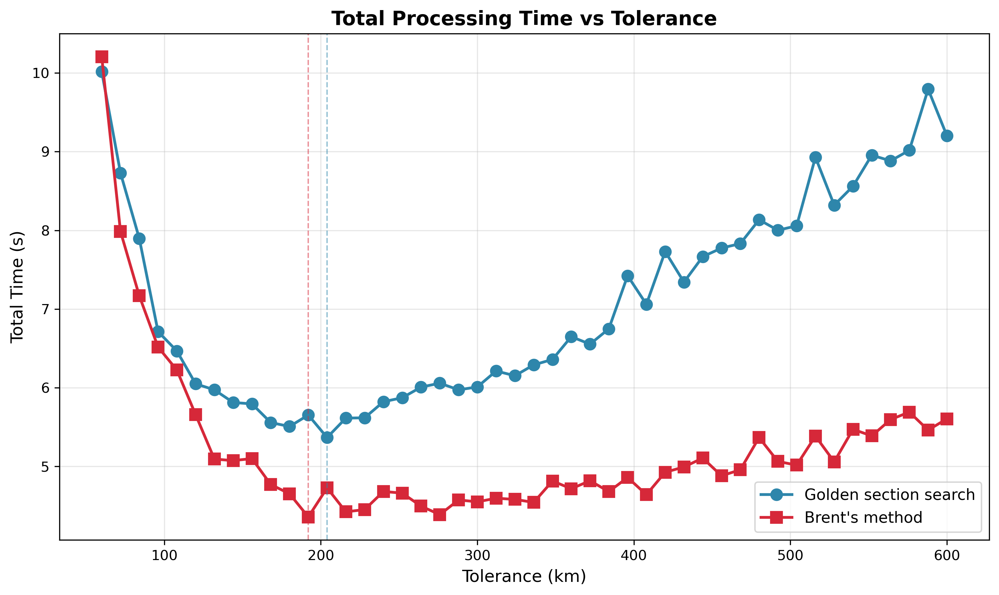
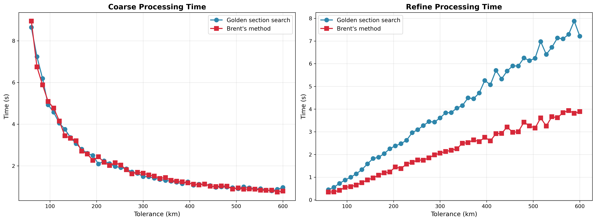

# Refinement Algorithm Comparison

The refinement stage finds the precise time of closest approach (TCA) within each coarse detection window. This
experiment
compares two optimization algorithms: golden section search and Brent's method.

## Algorithms

### Golden Section Search

A derivative-free univariate minimization method that narrows the search interval by the golden ratio (~1.618) at each
iteration. Simple and robust, but converges relatively slowly.

### Brent's Method

Combines parabolic interpolation with golden section search. Uses parabolic interpolation when it's working well
(superlinear convergence), but falls back to golden section when interpolation fails. Generally faster than pure golden
section search.

Implementation uses Apache Commons Math `BrentOptimizer` with 50ms absolute tolerance.

## Parameters

- **prepass-tolerance-km**: Fixed at 12.5 km
- **step-second-ratio**: Fixed at 12
- **interpolation-stride**: Fixed at 6
- **tolerance-km**: Swept from 60 to 600 km
- **lookahead-hours**: Fixed at 6 hours
- **threshold-km**: Fixed at 5.0 km

## Results

Benchmark on 25% satellite sample (7,397 satellites). Selected data points.

| Tol (km) | Coarse (G) | Coarse (B) | Refine (G) | Refine (B) | Total (G) | Total (B) | Speedup |
|----------|------------|------------|------------|------------|-----------|-----------|---------|
| 60       | 8.64s      | 8.95s      | 0.45s      | 0.35s      | 10.0s     | 10.2s     | 0.98x   |
| 120      | 4.05s      | 4.15s      | 1.15s      | 0.66s      | 6.05s     | 5.66s     | 1.07x   |
| 192      | 2.50s      | 2.27s      | 2.26s      | 1.23s      | 5.65s     | 4.36s     | 1.30x   |
| 300      | 1.49s      | 1.65s      | 3.61s      | 2.06s      | 6.01s     | 4.55s     | 1.32x   |
| 420      | 1.12s      | 1.09s      | 5.70s      | 2.92s      | 7.73s     | 4.93s     | 1.57x   |
| 600      | 0.97s      | 0.79s      | 7.21s      | 3.89s      | 9.20s     | 5.60s     | 1.64x   |

(G = Golden section search, B = Brent's method)

## Analysis

### Refine Time Reduced

Brent's method reduces refinement time by approximately **45-50%** compared to golden section search. At tolerance=600
km
with ~307,000 events to refine:

- Golden section: 7.21s
- Brent's method: 3.89s

The speedup is consistent across all tolerance values, indicating Brent's method converges in fewer function evaluations
regardless of event count.

### Total Time Improvement

At optimal tolerance for each algorithm, (204 and 192 km), Brent's method makes the total scan time **23% faster**. (
5.37s vs 4.36s)

### Conjunction Detection Unchanged

Both algorithms detect the same conjunctions:

| Method         | Conj Range | Dedup Range |
|----------------|------------|-------------|
| Golden section | 277-284    | 237-243     |
| Brent's method | 276-283    | 236-243     |

The ~1 conjunction difference is within noise. Both methods find the same minima; Brent's method simply converges
faster.

### Optimal Operating Point Shift

With Brent's method, the optimal tolerance range is broader and flatter. The U-shaped curve is less pronounced because
refinement time grows more slowly with tolerance. This gives more flexibility in parameter selection.

## Conclusion

**Brent's method reduces refinement time by ~50% over golden section search, with no accuracy loss.**

At optimal tolerance, total processing time improves by 19-30%. The improvement is more dramatic at higher tolerances
where refinement dominates. Since the algorithm change is drop-in (same interface, same guarantees), there's no reason
to use golden section search.
